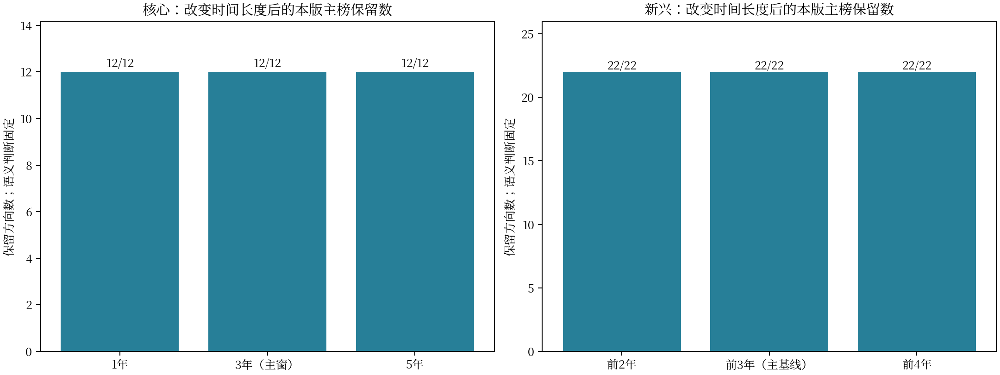
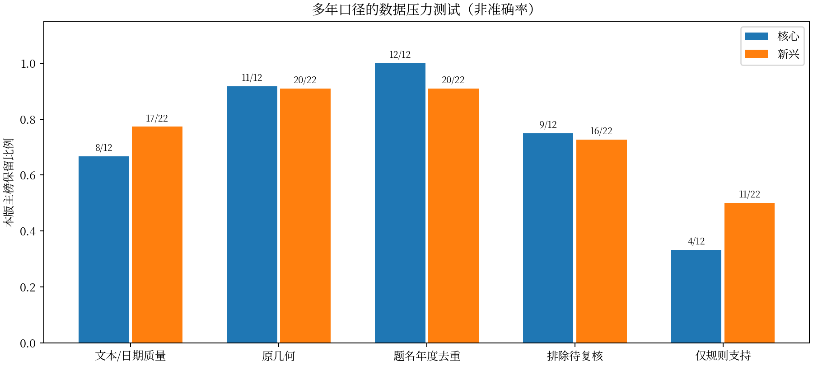

# 多年热点分析：消融与灵敏度实验

本版重做核心/新兴评分消融、门槛、时间窗与覆盖压力测试，保留潜在统一任务实验。共1500次权重扰动、172个情景，其中潜在71个情景。每类500次权重扰动，固定种子75020260925，各原权重乘0.8—1.2后归一。

## 评分与权重

| 热点类型 | 情景 | 排名池大小 | 排名Spearman相关 | 最大名次变动 |
| --- | --- | --- | --- | --- |
| core | remove_volume | 202 | 0.924 | 64.000 |
| core | remove_citation | 202 | 0.907 | 59.000 |
| core | remove_institutions | 202 | 0.993 | 21.000 |
| core | remove_persistence | 202 | 1.000 | 1.000 |
| core | remove_current | 202 | 0.997 | 14.000 |
| emerging | remove_multiyear_growth | 44 | 0.956 | 10.000 |
| emerging | remove_recent_growth | 44 | 0.931 | 14.000 |
| emerging | remove_trend | 44 | 0.965 | 10.000 |
| emerging | remove_quarter_consistency | 44 | 0.957 | 12.000 |
| emerging | remove_institution_expansion | 44 | 0.981 | 8.000 |
| potential | remove_patents | 4 | 0.316 | 2.000 |
| potential | remove_applicants | 4 | 0.316 | 2.000 |
| potential | remove_policy | 4 | 0.738 | 1.000 |

排名池为本次数值资格池；得分无硬入选阈值，单独改权重不改变正式资格。500次Spearman最小值：核心0.9910，新兴0.9842，潜在0.3162。稳定性不等于准确率。

## 多时间尺度和历史截止点

| 热点类型 | 情景 | 本版基准入选数 | 本版保留数 | 本版保留比例 | 增加ID | 退出ID |
| --- | --- | --- | --- | --- | --- | --- |
| core | cutoff_2025Q2 | 12 | 12 | 1.000 | — | — |
| emerging | cutoff_2025Q2 | 22 | 5 | 0.227 | — | C0091;C0098;C0186;C0191;C0210;C0216;C0294;C0348;C0435;C0443;C0533;C0542;C0566;C0600;C0665;C0713;C0725 |
| core | cutoff_2025Q4 | 12 | 12 | 1.000 | — | — |
| emerging | cutoff_2025Q4 | 22 | 9 | 0.409 | — | C0091;C0098;C0186;C0216;C0294;C0435;C0443;C0533;C0566;C0600;C0665;C0713;C0725 |
| core | cutoff_2026Q1 | 12 | 12 | 1.000 | — | — |
| emerging | cutoff_2026Q1 | 22 | 16 | 0.727 | — | C0186;C0216;C0251;C0566;C0665;C0725 |
| core | core_window_1y | 12 | 12 | 1.000 | — | — |
| core | core_window_5y | 12 | 12 | 1.000 | — | — |
| emerging | baseline_window_2y | 22 | 22 | 1.000 | — | — |
| emerging | baseline_window_4y | 22 | 22 | 1.000 | — | — |
| emerging | omit_baseline_year_1 | 22 | 20 | 0.909 | — | C0566;C0725 |
| emerging | omit_baseline_year_2 | 22 | 21 | 0.955 | — | C0725 |
| emerging | omit_baseline_year_3 | 22 | 22 | 1.000 | — | — |

本次核心在1/3/5年口径下均保留12项，新兴在2/3/4年背景下均保留22项；但逐年剔除时蒸汽重整制氢与废塑料回收转化存在未保留情景，已在主表单列提示。较早截止点的新兴入选较少，说明结果具有时期依赖性，不能将本版名单追认成早年已发现的热点。

核心1/3/5年按每年250篇及活跃季度比例缩放，不沿用固定总量门槛。新兴基线2/3/4年均与最近一年不重叠；逐个删去背景年度重算份额、机构和计数检验，最近同比/五年峰值保持。早期截止点只应用对应年份数值条件，不输入后续YTD确认；标签、语义和引用快照仍冻结，因此是回顾性窗口敏感性，不是独立历史预测回测。

## 数据覆盖与标签压力

| 热点类型 | 情景 | 本版基准入选数 | 本版保留数 | 本版保留比例 | 退出ID |
| --- | --- | --- | --- | --- | --- |
| core | quality | 12 | 8 | 0.667 | C0060;C0067;C0245;C0278 |
| emerging | quality | 22 | 17 | 0.773 | C0091;C0534;C0566;C0713;C0725 |
| core | geometry | 12 | 11 | 0.917 | C0060 |
| emerging | geometry | 22 | 20 | 0.909 | C0534;C0566 |
| core | dedup | 12 | 12 | 1.000 | — |
| emerging | dedup | 22 | 20 | 0.909 | C0294;C0725 |
| core | exclude_needs_review | 12 | 9 | 0.750 | C0067;C0169;C0245 |
| emerging | exclude_needs_review | 22 | 16 | 0.727 | C0098;C0216;C0294;C0348;C0435;C0443 |
| core | supported_only | 12 | 4 | 0.333 | C0067;C0122;C0155;C0169;C0245;C0251;C0278;C0473 |
| emerging | supported_only | 22 | 11 | 0.500 | C0091;C0098;C0186;C0210;C0216;C0251;C0294;C0348;C0435;C0443;C0473 |

每种过滤重算当期背景分母、机构集合与同发表年引用背景；新兴另保持主口径数据方向确认，属于条件压力测试，不声称跑完所有交叉过滤组合。删除待审或仅保留规则支持会改变文献构成，未通过不等于方向无价值。历史更长不自动消除这些偏差。

## 潜在方向：统一集合后的完整重算

原潜在部分已替换：固定比较池为4个任务单元，严格基线3个单元通过，其中空气源热泵为边界敏感的条件性跟踪。完成71个基线、门槛、数据与政策场景，284条单元结果；重新进行3项评分消融和500次权重扰动。核心/新兴现已改为本报告的多年口径；潜在任务定义及数值保持不变。

| 情景 | 排名Spearman相关 | 前1集合Jaccard | 前2集合Jaccard | 最大名次变动 |
| --- | --- | --- | --- | --- |
| remove_patents | 0.316 | 1.000 | 0.333 | 2.000 |
| remove_applicants | 0.316 | 1.000 | 0.333 | 2.000 |
| remove_policy | 0.738 | 0.000 | 1.000 | 1.000 |

调权时每项权重独立乘0.8—1.2后归一；500次潜在排名相关最低0.316。只有4个单元，采用前1/前2及名次变化，前10/前25不适用并留空。小池相关系数离散，不能与旧30方向的0.98以上相关混为同一稳健性证据。评分排序与数值门槛分离，调分不自动改变资格。

| 情景 | 本版基准入选数 | 本版保留数 | 本版保留比例 | 退出ID |
| --- | --- | --- | --- | --- |
| unified_strict | 3 | 3 | 1.000 | — |
| unified_expanded | 3 | 2 | 0.667 | U0650 |
| unified_title_only_evidence | 3 | 3 | 1.000 | — |
| unified_body_available | 3 | 3 | 1.000 | — |
| unified_original_candidates_only | 3 | 3 | 1.000 | — |
| unified_cross_candidates_only | 3 | 3 | 1.000 | — |
| unified_title_year_dedup | 3 | 3 | 1.000 | — |
| unified_no_manual_overrides | 3 | 3 | 1.000 | — |
| collapse_policy_by_publisher | 3 | 3 | 1.000 | — |
| pending_papers_only | 3 | 2 | 0.667 | U0650 |
| pending_patents_only | 3 | 3 | 1.000 | — |
| patent_positive_removal_10% | 3 | 3 | 1.000 | — |
| patent_positive_removal_20% | 3 | 3 | 1.000 | — |

数据场景逐次重建选中的论文、专利和申请主体集合：严格、扩展、仅题名证据、正文可用、仅原类别候选、仅跨标签候选、全库同题同年去重，以及不应用人工样本修订。正文可用和去重场景同时重算背景分母。按原类别/跨标签渠道的消融只测检索依赖，不把原类别当金标准。非对称待判上下界并非统计置信区间；10%/20%专利移除是确定性记录级误入假设，主体随记录删除重新统计，背景库保留这些记录。

门槛扫描规模、主体、政策组数及相对份额，联合网格扫描政策组×相对份额。每次政策移除均重新统计组数、强度与分数；按发布机构合并也完整重算。当前基线单元中，逐组删除政策会导致退出的单元为：电力大模型辅助决策与运维。政策删除结果使用同一已确认政策库，不代表实际政策因果作用。

1至5月比值使用双方同期论文/专利，不再沿用旧“1至5月专利对1至8月论文”的非同期指标。政策仍截至8月，不能称为5月时点预测。专利后期覆盖稀疏、检索召回与跨来源语言差异仍是限制。严格口径通过而扩展口径退出的方向保留敏感标记，不通过调整定义维持榜单。

所有逐次权重、阈值扫描及情景入选依据见[实验Excel](750类热点消融实验与灵敏度分析.xlsx)。本版不以调权稳定代替分类质量验证，也不以多年窗口替代专家评审。
